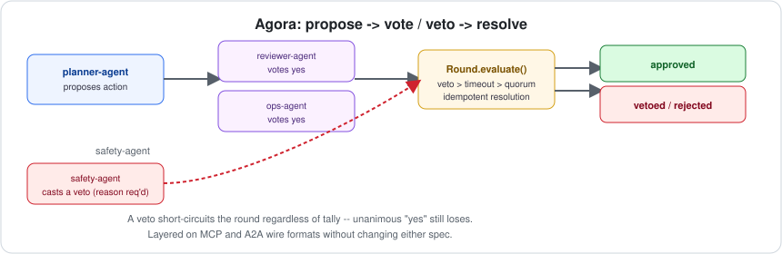

# Agora

[](https://github.com/jayblast-spec/agora/actions/workflows/ci.yml)
[](https://www.npmjs.com/package/agora-protocol)
[](./LICENSE)
[](https://agora-protocol.vercel.app)



**Propose, vote, veto, and quorum semantics for multi-agent systems — layered on top of [MCP](https://modelcontextprotocol.io) and [A2A](https://a2a-protocol.org) without changing either spec.**

## The gap this fills

A September 2026 protocol analysis, [*Governance Gaps in Agent Interoperability Protocols*](https://arxiv.org/abs/2606.31498), examined MCP, A2A, ACP, ANP, and ERC-8004 — every major agent interoperability protocol in production use — and found that **voting and dissent preservation are universally absent** across all five. None of them define a quorum primitive, a preference-aggregation rule, or a way to record that a proposal was rejected and why. When multiple agents need to jointly decide whether to take an action, every team currently hand-rolls this logic, differently, inside their own orchestration code.

Agora is a reference implementation of the primitives that analysis found missing: a small, dependency-free state machine for **propose → vote/veto → resolve**, plus reference adapters showing how to carry that deliberation over real A2A messages and real MCP tool calls — so you don't need a new protocol, a new server, or a new spec revision to use it.

## Install

```bash
npm install agora-protocol
```

## Quickstart

```ts
import { Round } from "agora-protocol";

const round = Round.propose({
  id: "deploy-2026-09-15",
  proposerId: "planner-agent",
  action: { type: "deploy", service: "checkout-api", version: "4.2.0" },
  voters: ["planner-agent", "reviewer-agent", "ops-agent"],
  quorum: { type: "fraction", value: 2 / 3 },
});

round.castVote({ agentId: "planner-agent", choice: "yes" });
round.castVote({ agentId: "reviewer-agent", choice: "yes" });

const resolution = round.evaluate();
// { outcome: "approved", tally: {...}, resolvedAt: ... }
```

Add a safety veto that overrides any vote tally:

```ts
const round = Round.propose({
  id: "delete-prod-bucket",
  proposerId: "cleanup-agent",
  action: { type: "delete", resource: "s3://prod-user-uploads" },
  voters: ["cleanup-agent", "ops-agent"],
  vetoers: ["safety-agent"],
  quorum: { type: "count", value: 2 },
});

round.castVote({ agentId: "cleanup-agent", choice: "yes" });
round.castVote({ agentId: "ops-agent", choice: "yes" });
round.castVeto({ agentId: "safety-agent", reason: "no confirmed backup exists for this bucket" });

round.evaluate();
// { outcome: "vetoed", veto: {...}, resolvedAt: ... }  <- unanimous "yes" still loses
```

Run the full annotated demo (both scenarios above, plus the wire-format messages):

```bash
npx tsx examples/demo.ts
```

## Architecture

```
            ┌─────────────────────────┐
            │        Round (core)     │   pure state machine, zero deps
            │  propose → vote/veto →  │   Proposal, Vote, Veto, Tally,
            │        evaluate()       │   Resolution
            └────────────┬────────────┘
                          │ toState() / fromState()
                 ┌────────┴────────┐
                 │    RoundStore   │   pluggable persistence interface
                 │  (in-memory ↦   │   bring your own: Postgres, Redis, ...
                 │   shipped)      │
                 └─────────────────┘
       ┌──────────────────┴──────────────────┐
       │                                      │
┌──────┴───────┐                     ┌────────┴───────┐
│ A2A adapter   │                     │  MCP adapter   │
│ encode/decode │                     │ encode/decode  │
│ propose/vote/ │                     │ as tools/call  │
│ veto/resolve  │                     │ + notification │
│ as A2A        │                     │                │
│ Message/Part  │                     │                │
└───────────────┘                     └────────────────┘
```

- **Core has no I/O and no protocol knowledge.** It only knows about proposals, votes, vetoes, and resolutions.
- **Adapters have no decision logic.** They only translate Agora's internal message shapes into the wire format of a real protocol (and back), so any A2A- or MCP-speaking agent can participate without adopting a new transport.
- **Storage is a 4-method interface** (`save`/`load`/`delete`/`listIds`). The shipped `InMemoryRoundStore` is for tests and single-process demos; production use should supply a durable implementation.

## Design decisions worth knowing

- **Ties resolve to `"rejected"`.** An evenly split vote shouldn't change the status quo.
- **Abstentions count toward quorum, not toward the yes/no tally.** An abstaining agent participated; it just didn't take a side.
- **Fraction quorum is evaluated against registered voters, not votes cast** — so a quorum requirement can't be gamed down by agents simply not responding.
- **A veto is a distinct outcome from a "no" vote** and short-circuits the round regardless of tally. Only registered `vetoers` may cast one; a veto reason is mandatory (an unexplained veto isn't auditable).
- **Duplicate votes are last-write-wins**, not accumulated — an agent may change its mind until the round resolves.
- **Resolution is idempotent.** Once a `Round` resolves, `evaluate()` always returns that same `Resolution`, even if called again after a timeout or more votes arrive. What happened stays unambiguous.
- **Timeouts never resolve silently as approved or rejected.** A timed-out round carries the partial tally that existed at expiry as its own distinct outcome.

## Non-goals (v1)

- **Not Byzantine-fault-tolerant.** Agora assumes participating agents are identified and not actively malicious — it solves the *coordination* gap the research identified, not adversarial consensus (see distributed-systems literature like Raft/PBFT for that problem).
- **No transport, no network layer, no server.** Agora is a library; you already have a way for your agents to exchange messages, and the adapters just shape Agora's data to fit it.
- **Dissent is visible in a `Resolution`, but not yet a separately queryable permanent record.** A `rejected`/`vetoed` outcome carries its tally/veto reason, but a durable, cross-round dissent log is planned for a follow-up release, not v1.

## API reference

| Export | What it is |
|---|---|
| `Round.propose(input)` | Construct a new pending round from a `ProposalInput`. Throws `InvalidProposalError` if voters are empty or quorum is unreachable. |
| `round.castVote({ agentId, choice, reason? })` | Register/overwrite a vote. Throws `NotAVoterError` / `RoundAlreadyResolvedError`. |
| `round.castVeto({ agentId, reason })` | Cast a blocking veto. Throws `NotAVetoerError` / `RoundAlreadyResolvedError`. |
| `round.evaluate(now?)` | Resolve if veto/timeout/quorum applies; otherwise returns `null`. Idempotent. |
| `round.getTally()` | Current weighted tally without resolving. |
| `round.toState()` / `Round.fromState(state)` | Serialize/restore for persistence. |
| `InMemoryRoundStore` | Reference `RoundStore` implementation. |
| `adapters/a2a` | `encodeProposal/Vote/Veto/Resolution` + matching `decode*` functions, shaped as A2A `Message`/`Part` objects. |
| `adapters/mcp` | `encodeProposalCall/VoteCall/VetoCall` + `encodeResolutionNotification` + matching `decode*` functions (returning `{ roundId, vote }` / `{ roundId, veto }`), shaped as MCP JSON-RPC `tools/call` requests and notifications. |

Full types are in [`src/core/types.ts`](./src/core/types.ts).

## Development

```bash
npm install
npm run typecheck
npm test
npm run build
```

## License

MIT
